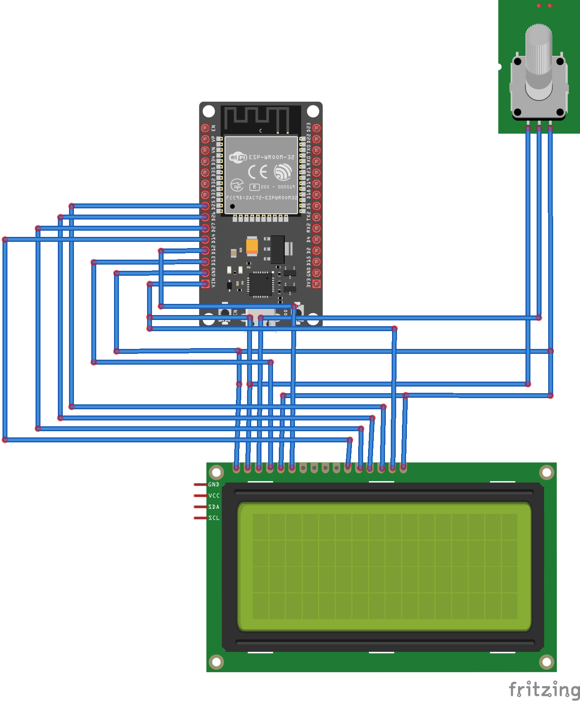

# Fronius Solar Display

This project is an ESP32 (Arduino) based solar power display that monitors and displays photovoltaic (PV) production, grid consumption, and home consumption data on cheap a 20x4 (!) Liquid Crystal Display (LCD). It displays current PV production and grid in- or output.

You can place it in a central part of your kitchen, living room, or wherever you want to check your PV status without having to open up some App or website. Its main purpose is to have a quick and easy glance at your PV status for deciding when to turn on what electricity-consuming devices in your home. Just check you have sufficient WiFi coverage where you want to put it.

## System Requirements

Requires the Fronius Solar API v1 to work (Can be found on Fronius Symo, Galvo, Gen24, Tauro inverters ...).

In addition, it requires a principal Fronius smart meter installed directly alongside your main electricity meter for displaying actual grid metrics. This must obviously be connected to your main inverter. It also works with additional/supplemental inverters not connected directly to the main inverter but registered with help of a separate, Fronius Smart Meter.

Only works in IPv4 networks preferrably with subnet 255.255.255.0 / 24.

## Features

- Displays PV production, grid consumption, and home consumption data on an LCD.
- Displays maximum grid voltage deviation value (gV). European grids feature 230V with a maximum of 10% (23V) deviation.
- Displays WiFi RSSI signal strength (RSSI) and connection errors when retrieving inverter data (E). (Connection errors are automatically reset after 5 minutes.)
- Configurable via WiFiManager by @tzapu.
- Stores inverter IP and MAC addresses in preferences.
- Automatically resolves IP address using MAC address if the IP address changes.
- Handles multiple connection errors and reboots if necessary.

## Hardware Requirements

- ESP32 WROOM DA Module or other ESP32 dev module.
- 20x4 Liquid Crystal Display (LCD) (standard Arduino LCD with no I2C module required!)
- B10K Potentiometer
- WiFi network
- Fronius solar inverter connected to your local network with API v1 access enabled, and a Fronius smart meter (connected to your inverter) alongside your electricity meter.

## Wiring

Refer to the following wiring diagram for connecting the LCD to the ESP32:

| LCD Pin | ESP32 Pin |
|---------|-----------|
| RS      | 13        |
| EN      | 12        |
| D4      | 14        |
| D5      | 27        |
| D6      | 26        |
| D7      | 25        |
| VIN     | 5V        |
| GND     | GND       |

## Required Libraries

- [ArduinoJson](https://github.com/bblanchon/ArduinoJson)
- [WiFiManager](https://github.com/tzapu/WiFiManager)
- [Preferences](https://github.com/espressif/arduino-esp32/tree/master/libraries/Preferences)
- [HTTPClient](https://github.com/espressif/arduino-esp32/tree/master/libraries/HTTPClient)

## Installation

1. Download the compiled firmware.bin 
2. Download the flash download tool from Espressif: https://docs.espressif.com/projects/esp-test-tools/en/latest/esp32/production_stage/tools/flash_download_tool.html
3. Upload the firmware to your ESP32.
0x1000 - bootloader.bin 
0x8000 - partitions.bin 
0x10000 - firmware.bin

- or - 

1. Clone this repository to your local machine.
2. Open the project in PlatformIO.
3. Install the required libraries using PlatformIO Library Manager.
4. Upload the code to your ESP32 module.

After flashing the ESP32 will open up a WiFi Access point "SOLAR_POWER_DISPLAY". Connect to it and navigate to the website at 192.168.4.1.

## Usage

1. Power on the ESP32 module.
2. The device will attempt to connect to the last known WiFi network. If it fails, it will start the WiFiManager configuration portal.
3. After flashing the ESP32 will open up a WiFi Access point "SOLAR_POWER_DISPLAY". Connect to it and navigate to the website at 192.168.4.1. Connect to the WiFiManager configuration portal and configure FIRST the inverter IP address under the SETUP menu, THEN the WiFi network to connect to.
4. The device will display the PV production, grid consumption, and home consumption data on the LCD.

If later on you want to re-connect to the WiFi-Manager configuration portal just press the BOOT switch on your ESP32 devboad. If you press the switch for 3+ secs it will erase all previously stored configuration data.

## Case

A nice slightly modified case template for your 3d printer can be found in the case directory (CC by attribution license), the original by Robine is here: https://www.thingiverse.com/thing:2627756. You will need some hot glue to fix the parts in.

## Troubleshooting

- If the device fails to connect to the WiFi network, it will start the WiFiManager configuration portal. Follow the instructions to reconfigure the network settings.
- If the device encounters multiple connection errors, it will reboot automatically.
- Ensure that the inverter IP and MAC addresses are correctly configured in the preferences.

## License

This project is licensed under the CC-BY-NC: https://creativecommons.org/licenses/by-nc/4.0/. See the [LICENSE](LICENSE) file for details.

## Acknowledgements

- [ArduinoJson](https://github.com/bblanchon/ArduinoJson) by Benoit Blanchon
- [WiFiManager](https://github.com/tzapu/WiFiManager) by tzapu
- [PlatformIO](https://platformio.org/) for the development environment
- [netscanner-lib](attached) has been developed based on some code  https://github.com/agentzex/ESP_network_ip_scanner by agentzex
