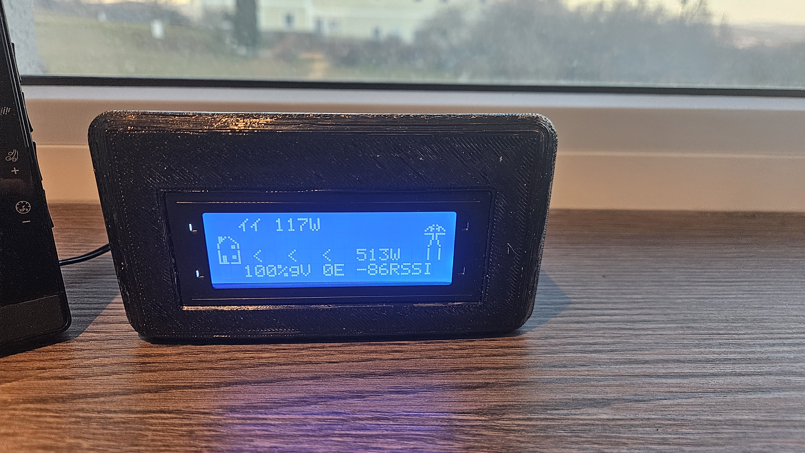

# Fronius Solar Display

An ESP32 (Arduino) based solar power display that reads photovoltaic production, grid
import/export and home consumption from a Fronius inverter's **Solar API v1** and shows them
on a cheap 20×4 character LCD — no I²C backpack, no app, no website.

Put it somewhere you actually walk past: kitchen, hallway, living room. Its whole purpose is
a glance that tells you whether now is a good moment to run the dishwasher.

> **This is v2.** The v1 code is preserved on the [`v1` branch](../../tree/v1), along with
> its Fritzing sketch. The application logic is the same; v2 rewrites the hardware layer,
> fixes a set of latent memory bugs, adds OTA and makes the WiFi link actually survive a
> marginal signal. [ARCHITECTURE.md](ARCHITECTURE.md) documents all of it.

## System requirements

- A Fronius inverter with **Solar API v1** (Symo, Galvo, Gen24, Tauro …).
- A **Fronius Smart Meter** installed alongside your main electricity meter and connected to
  the inverter — without it there are no grid figures. Supplemental inverters not directly
  connected also work, provided they are registered via a Smart Meter.
- An IPv4 network, preferably a /24 (`255.255.255.0`) subnet.

## Features

- PV production, grid import/export and home consumption on a 20×4 LCD.
- Maximum grid-voltage deviation (`gV`). European grids run 230 V with a 10% (23 V) limit.
- WiFi signal strength (`RSSI`) and inverter connection errors (`E`), errors self-clearing
  after five minutes.
- Configured over WiFi through a captive portal ([WiFiManager](https://github.com/tzapu/WiFiManager)
  by @tzapu) — no credentials in the source.
- Remembers the inverter's IP **and MAC**, and re-finds it by MAC when DHCP moves it.
- **OTA updates** over WiFi once the first USB flash is done.
- Survives a weak link: radio tuning (power-save off, HT20, 802.11b retained), a blocking
  boot-connect retry loop, and active reconnect supervision rather than trusting the stack.

## Hardware

| | |
|---|---|
| **Board** | ESP32-WROOM-32 DevKit (4 MB flash) — v2 was developed on a uPesy board |
| **Display** | HD44780-compatible 20×4 character LCD, 4-bit parallel, run at **5 V** |
| **Contrast** | B10K potentiometer |
| **Power** | **An external 5 V supply — see below** |
| **Input** | The board's on-board BOOT button |

### Wiring

| LCD pin | Signal | ESP32 |
|---|---|---|
| 4 | RS | GPIO 13 |
| 6 | E | GPIO 33 |
| 11 | D4 | GPIO 14 |
| 12 | D5 | GPIO 27 |
| 13 | D6 | GPIO 26 |
| 14 | D7 | GPIO 25 |
| 1, 5, 16 | VSS, **RW**, backlight cathode | GND |
| 2, 15 | VDD, backlight anode | 5V |
| 3 | V0 | Potentiometer wiper (outer legs to 5 V and GND) |

Pins 7–10 (D0–D3) stay open — 4-bit mode uses D4–D7 only.

All eight connections land on the DevKit's **left header**, so no wire crosses the board:

```
3V3 EN 36 39 34 35 32  33  25  26  27  14  12  GND  13  9 10 11  5V
                        E  D7  D6  D5  D4  ✗  rail  RS  ·  ·  ·  rail
```

Three things that are not optional:

- **`RW` (pin 5) must be tied to GND.** It puts the HD44780 in write-only mode, which is also
  what makes driving a 5 V display from 3.3 V GPIOs safe — the data pins stay inputs and
  never drive 5 V back into a non-5 V-tolerant ESP32.
- **Leave GPIO 12 bare.** It is the MTDI strapping pin: held high at reset it selects 1.8 V
  for the flash core and the module will not boot. It sits *inside* the run of pins we use,
  between D4 and GND, so it is easy to hit by miscounting. (v1 ran EN here and got away with
  it; v2 uses GPIO 33 instead.)
- **Use an external 5 V supply.** USB power is not enough. The LCD with its backlight plus
  the ESP32's transmit bursts sag the rail, and because contrast is ratiometric the display
  goes unreadable — which looks exactly like a wiring fault. USB is for flashing and serial.

## Build & flash

[PlatformIO](https://platformio.org/). The first flash of a blank board must go over USB,
because OTA needs firmware that already contains ArduinoOTA.

```bash
# USB — the default environment
pio run -t upload
pio device monitor -b 115200

# Over the network, once it is on WiFi
pio run -e esp32-wroom-32-ota -t upload
```

If `esptool` reports `Wrong boot mode detected (0x13)`, this board's auto-reset isn't pulling
GPIO 0 low: **hold BOOT through the `Connecting......` dots** and release once writing starts.

> ⚠️ `OTA_PASSWORD` is `"changeme"` in [src/main.cpp](src/main.cpp). Anyone on your LAN can
> reach port 3232. Change it, and keep `upload_flags = --auth=…` in
> [platformio.ini](platformio.ini) matching.

## First run

1. Power up. The display shows a splash, then tries saved credentials.
2. With none saved it raises an access point, **`SOLAR_POWER_DISPLAY`**. Join it and open
   `192.168.4.1`.
3. Enter your WiFi details and the inverter's IPv4 address.
4. To wipe the configuration later, hold the **BOOT** button for three seconds.

## Case

[`case/`](case/) holds a 3D-printable cap for the 20×4 module, under its own licence.

## Documentation

[ARCHITECTURE.md](ARCHITECTURE.md) is the real reference: the runtime state machine, the WiFi
supervision logic and why it exists, the Solar API quirks, the memory bugs fixed in the port,
and a catalogue of the hardware traps this project has walked into — including the 0 Ω antenna
resistor that cost 30 dB, and the serial-terminal DTR line that silently factory-resets the
device.

## Licence

[Creative Commons Attribution-NonCommercial 4.0 International](LICENSE.md).
